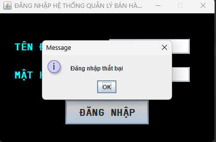

[![Contributors][contributors-shield]][contributors-url] ![languagecount][language-count-shield] ![license][license-shield] [![GitHub followers][followers-shield]][contributors-url]

 
<!-- Giới thiệu bản thân -->

    
     <h3 align="center">NGUYỄN THIẾT DUY ĐAN</h3>
     <h3 align="center" style="margin:0">63133615</h3>

<!-- Mục lục -->

  
Mục lục

  <ol style="font-size:15px;" >
    <li>
      <a href="#giới-thiệu-về-java">Giới thiệu về Java</a>
      <ul>
        <li><a href="#java">Java</a></li>
        <li><a href="#một-số-đặc-điểm-của-java">Một số điểm nổi bật về Java</a></li>
        <li><a href="#javaswing">JavaSwing</a></li>
      </ul>
    </li>
    <li>
        <a href="#các-bài-thực-hành-đặc-biệt">Các bài thực hành đặc biệt</a>
        <ul>
            <li><a href="#simple-calculator">TH_Bai0_SimpleCalculator</a></li>
            <li></li>
        </ul>
    </li>
  </ol>

## Giới thiệu về Java

### Java

    Java là một ngôn ngữ lập trình và một nền tảng phát triển phần mềm được ra mắt vào năm 1995 bởi Sun Microsystems (nay là một phần của Oracle Corporation). Java được phát triển với triết lý "Write Once, Run Anywhere" (Viết Một Lần, Chạy Mọi Nơi), có nghĩa là mã Java có thể chạy trên bất kỳ nền tảng nào có Java Virtual Machine (JVM), bao gồm máy tính cá nhân, thiết bị di động và máy chủ.

### Một số đặc điểm của Java

    <ol>
        <li>Độ tin cậy và bảo mật: Java được thiết kế để có tính bảo mật cao, với cơ chế kiểm soát truy cập vào tài nguyên hệ thống</li>
        <li>Đa nền tảng: Mã Java có thể chạy trên nhiều nền tảng khác nhau mà không cần phải biên dịch lại.</li>
        <li>Đa mục đích: Java được sử dụng cho một loạt các ứng dụng, từ phần mềm máy tính đến ứng dụng di động, trang web và phần mềm máy chủ.</li>
        <li>Hỗ trợ thư viện phong phú: Java có một hệ sinh thái phong phú của thư viện và framework, giúp cho việc phát triển ứng dụng trở nên dễ dàng và nhanh chóng.</li>
        <li>Ngôn ngữ hướng đối tượng: Java là một ngôn ngữ lập trình hướng đối tượng, với tính năng như đóng gói (encapsulation), kế thừa (inheritance), và đa hình (polymorphism).</li>
        <li>Dễ học và sử dụng: Java có cú pháp đơn giản và rõ ràng, giúp người mới học lập trình dễ dàng tiếp cận.</li>
        <li>Hỗ trợ mạnh mẽ từ cộng đồng: Java có một cộng đồng lớn và năng động của các nhà phát triển, cung cấp các tài liệu, công cụ và hỗ trợ để giải quyết các vấn đề lập trình.</li>
    </ol>

(<a href="#readme-top">Trở về trên đầu</a>)

### JavaSwing

Java Swing là một bộ công cụ phát triển giao diện người dùng (GUI) trong ngôn ngữ lập trình Java. Nó được sử dụng để tạo ra các ứng dụng máy tính có giao diện đồ họa đa nền tảng và có khả năng tương tác với người dùng.

## Các bài thực hành đặc biệt

### Simple Calculator

Xây dựng tính toán với Swing thực hiện các phép tính đơn giản" +, - , *, chia. 

<ol>
    <li>
        <b>Giao diện ban đầu</b> 
        
    </li>
     <li>
        <b>Phép tính cộng</b> 
        
    </li>
    <li>
        <b>Phép tính trừ</b> 
        
    </li>
    <li>
        <b>Phép tính nhân</b> 
        
    </li>
    <li>
        <b>Phép tính chia</b> 
        
    </li>
</ol>

(<a href="#readme-top">Trở về trên đầu</a>)

### Login

Xây dựng Form đăng nhập hệ thống Quản lý bán hàng. Nếu tên đăng nhập =63CNTT và mật khẩu =123 thì hiện Form Màn Hình Chính, ngược lại hiện một thông báo lỗi đăng nhập và yêu cầu nhập lại thông tin.

<ol>
    <li>
        <b>Giao diện login</b> 
        
    </li>
    <li>
        <b>Đăng nhập thành công</b> 
        
    </li>
    <li>
        <b>Đăng nhập thất bại</b> 
        
    </li>

</ol>

(<a href="#readme-top">Trở về trên đầu</a>)

## Other

    
[![Bootstrap][Bootstrap.com]][Bootstrap-url]

[contributors-shield]: https://img.shields.io/github/contributors/nguyenduydan/63133615_JavaProgramming?color=blue
[contributors-url]: https://github.com/nguyenduydan/63133615_JavaProgramming/graphs/contributors
[language-count-shield]: https://img.shields.io/github/languages/count/nguyenduydan/63133615_JavaProgramming?color=red
[license-shield]: https://img.shields.io/github/license/nguyenduydan/63133615_JavaProgramming
[followers-shield]: https://img.shields.io/github/followers/nguyenduydan?style=flat
[Bootstrap.com]: https://img.shields.io/badge/Bootstrap-563D7C?style=for-the-badge&logo=bootstrap&logoColor=white
[Bootstrap-url]: https://getbootstrap.com
